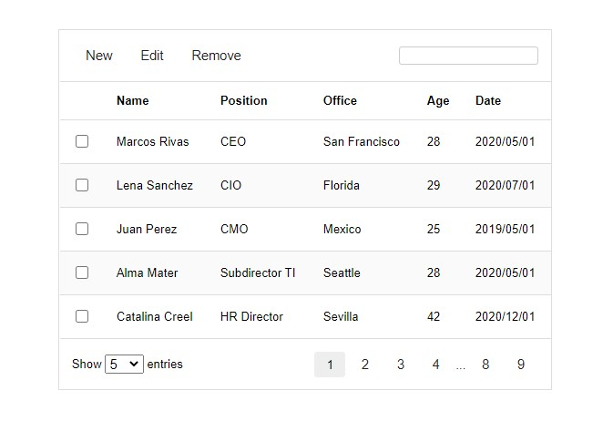

# datatable
DataTable implementation using Vanilla Javascript 



## Installation

Datatable works mapping a current table with `<thead>` and `<tbody>`

```html
 <table id="tabla01">
        <thead>
            <tr>
                <th>Name</th>
                <th>Position</th>
                <th>Office</th>
                <th>Age</th>
                <th>Date</th>
            </tr>
        </thead>
        <tbody>
            <tr>
                <td>Marcos Rivas</td>
                <td>CEO</td>
                <td>San Francisco</td>
                <td>28</td>
                <td>2020/05/01</td>
            </tr>
            <tr>
                <td>Lena Sanchez</td>
                <td>CIO</td>
                <td>Florida</td>
                <td>29</td>
                <td>2020/07/01</td>
            </tr>
            <tr>
                <td>Juan Perez</td>
                <td>CMO</td>
                <td>Mexico</td>
                <td>25</td>
                <td>2019/05/01</td>
            </tr>
        </tbody>
    </table>
```

We include the CSS file

```css
<link rel="stylesheet" href="dist/css/datatable.css">
```

and Javascript file

```javascript
<script src="dist/datatable.js"></script>
<script>
        
        const dt = new DataTable('#tabla01', {
            showCheckboxes: true,
            showHeaderButtons: 'always',
            showSearch: true,
            showEntries: true,
            numberOfEntries: 5,
            headerButtons: ['New', 'Edit', 'Delete']
        });
        dt.createFromTable();
```
